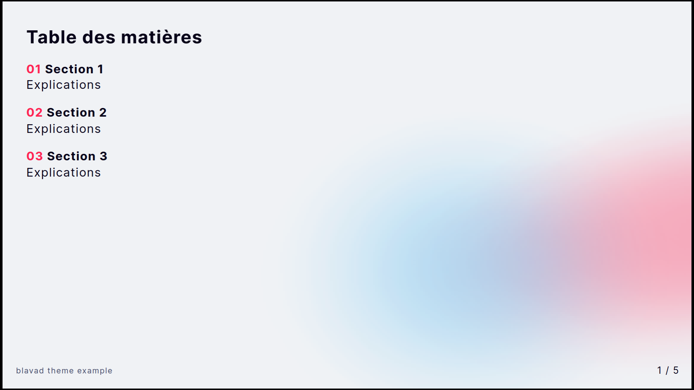
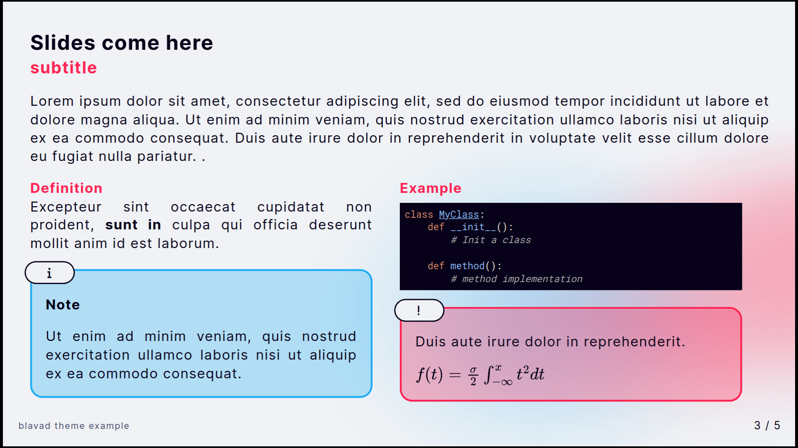
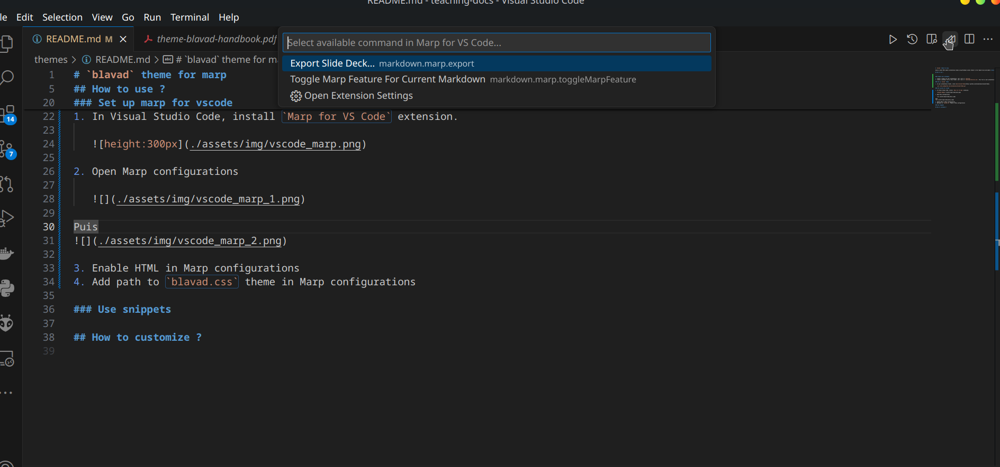

# `blavad` theme for marp

Easily create PDFs modern presentation media using Markdown syntax thanks to the ready-to-use and modern **blavad** theme for marp.

<iframe src="https://raw.githubusercontent.com/blavad/marp-blavad-theme/main/theme-blavad-example.pdf" style="width:600px;height:500"></iframe>

<!-- <div style="display:flex;flex-direction:row">

<div style="flex:0.3">

<div>
<div style="flex:0.3">

<div>

<div style="flex:0.3">

<div>

<div> -->

## How to install ?

### Prepare your workspace

1. Create a folder for your presentation. Let's call it `teaching`.
2. Create a markdown file in this folder. Let's call it `teaching/statistics.md`. This file is your presentation.

### Set up `blavad` theme

1. In your presentation folder, clone [marp-blavad-theme](https://github.com/blavad/marp-blavad-theme).

   ```bash
   cd teachings
   git clone git@github.com:blavad/marp-blavad-theme.git
   ```

### Set up marp for vscode

1. In Visual Studio Code, install `Marp for VS Code` extension.

   

2. Open Marp settings

   

3. Enable HTML in Marp settings
4. Add path to `blavad.css` theme in Marp settings.

   If you followed the previous steps, add `./marp-blavad-theme/blavad.css`

### Use snippets

In order to work faster, we recommand to use Snippets. Get snippets for `blavad`theme as follow.

1. Open the file `marp-blavad-theme/snippets.json`
1. In VS Code, open command tab `Ctrl` + `Maj` + `P` then open `Snippets: Configure User Snippets`
1. Open `markdown.json` and copie / paste `blavad` snippets
1. You are now ready to use snippets and easily create your slides

## How to use ?

To see how to use the `blavad` theme, please refer to the following documents. It is worth comparing the description of the slides in Markdown with the PDF result.

- [Usage example (PDF)](https://raw.githubusercontent.com/blavad/marp-blavad-theme/main/theme-blavad-example.pdf)

- [Usage example (Markown)](https://raw.githubusercontent.com/blavad/marp-blavad-theme/main/theme-blavad-example.md)
- [Usage example (PDF)](https://raw.githubusercontent.com/blavad/marp-blavad-theme/main/theme-blavad-handbook.pdf)
- [Usage example (Markdown)](https://raw.githubusercontent.com/blavad/marp-blavad-theme/main/theme-blavad-handbook.md)

## How to customize ?
