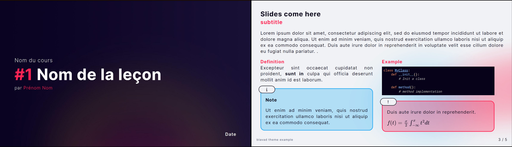
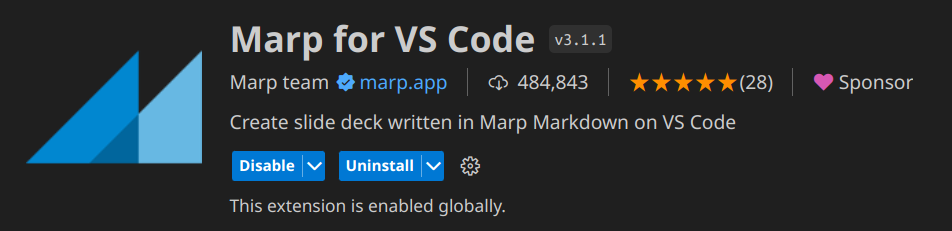
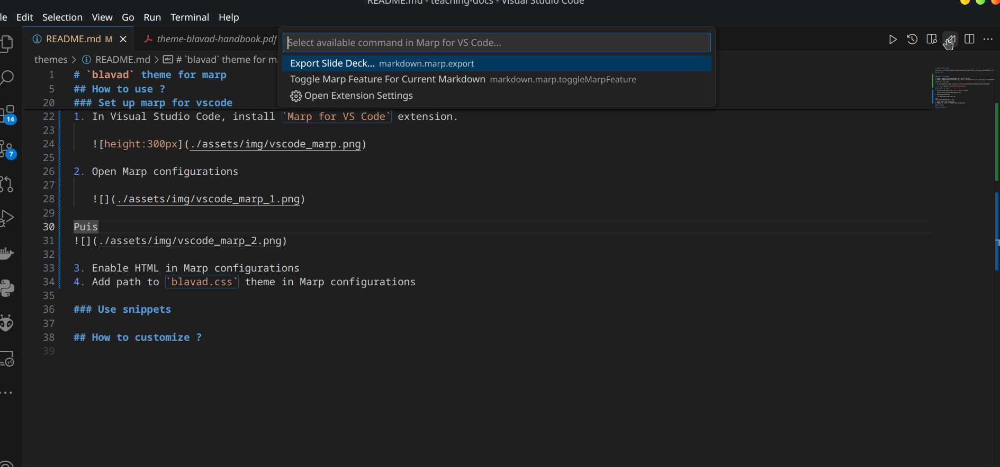
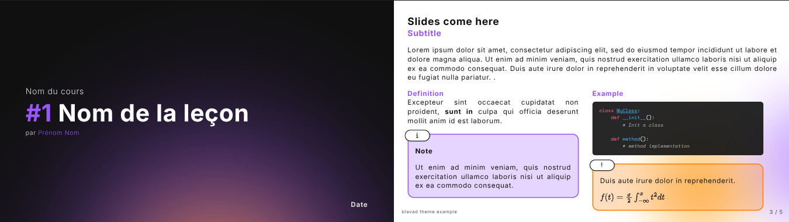

# `blavad` theme for marp

Easily create PDFs modern presentation media using Markdown syntax thanks to the ready-to-use and modern **blavad** theme for marp.



## How to install ?

### Prepare your workspace

1. Create a folder for your presentation. Let's call it `teaching`.
2. Create a markdown file in this folder. Let's call it `teaching/statistics.md`. This file is your presentation.

### Set up `blavad` theme

1. In your presentation folder, clone [marp-blavad-theme](https://github.com/blavad/marp-blavad-theme).

   ```bash
   cd teachings
   git clone git@github.com:blavad/marp-blavad-theme.git
   ```

### Set up marp for vscode

1. In Visual Studio Code, install `Marp for VS Code` extension.

   

2. Open Marp settings

   

3. Enable HTML in Marp settings
4. Add path to `blavad.css` theme in Marp settings.

   If you followed the previous steps, add `./marp-blavad-theme/blavad.css`

### Use snippets

In order to work faster, we recommand to use Snippets. Get snippets for `blavad`theme as follow.

1. Open the file `marp-blavad-theme/snippets.json`
1. In VS Code, open command tab `Ctrl` + `Maj` + `P` then open `Snippets: Configure User Snippets`
1. Open `markdown.json` and copie / paste `blavad` snippets
1. You are now ready to use snippets and easily create your slides

## How to use ?

To see how to use the `blavad` theme, please refer to the following documents. It is worth comparing the description of the slides in Markdown with the PDF result.

- [Usage example (PDF)](https://raw.githubusercontent.com/blavad/marp-blavad-theme/main/theme-blavad-example.pdf)

- [Usage example (Markown)](https://raw.githubusercontent.com/blavad/marp-blavad-theme/main/theme-blavad-example.md)
- [Usage example (PDF)](https://raw.githubusercontent.com/blavad/marp-blavad-theme/main/theme-blavad-handbook.pdf)
- [Usage example (Markdown)](https://raw.githubusercontent.com/blavad/marp-blavad-theme/main/theme-blavad-handbook.md)

## How to customize ?

The `blavad` theme can be easily modified for a customized look. Here is an example below and how to set it up.



### Step 1 — Generate background images

Use the `generate_bg.py` script by specifying your primary and secondary colors:

```bash
python generate_bg.py \
  --primary "#9a56ff" \
  --secondary "#ff7d00" \
  --output assets/img/my-theme
```

This generates the following files in the output folder:

| File           | Usage                          |
| -------------- | ------------------------------ |
| `bg-1.png`     | Standard slide background      |
| `bg-2.png`     | Alternative background (`bg2`) |
| `bg-3.png`     | Alternative background (`bg3`) |
| `bg-cover.png` | Cover slide background         |

### Step 2 — Create the `custom-theme.css` file

Create a `custom-theme.css` file with your chosen colors and the previously generated backgrounds:

```css
/* custom-theme.css */
/* @theme custom-theme */
@import "blavad";

/* Color overrides */
:root {
  --color-black-base: 16, 16, 16;
  --color-white-base: 255, 255, 255;
  --color-blue-base: 154, 86, 255;
  --color-orange-base: 255, 125, 0;

  --color-primary-base: var(--color-blue-base);
  --color-secondary-base: var(--color-orange-base);
}

/* Background image overrides */
section {
  background-image: url(./assets/img/my-theme/bg-1.png);
}

section.cover,
section.bg-cover {
  background-image: url(./assets/img/my-theme/bg-cover.png);
}

section.bg2 {
  background-image: url(./assets/img/my-theme/bg-2.png);
}

section.bg3 {
  background-image: url(./assets/img/my-theme/bg-3.png);
}
```

Then declare the theme in your presentation:

```yaml
---
theme: custom-theme
---
```
